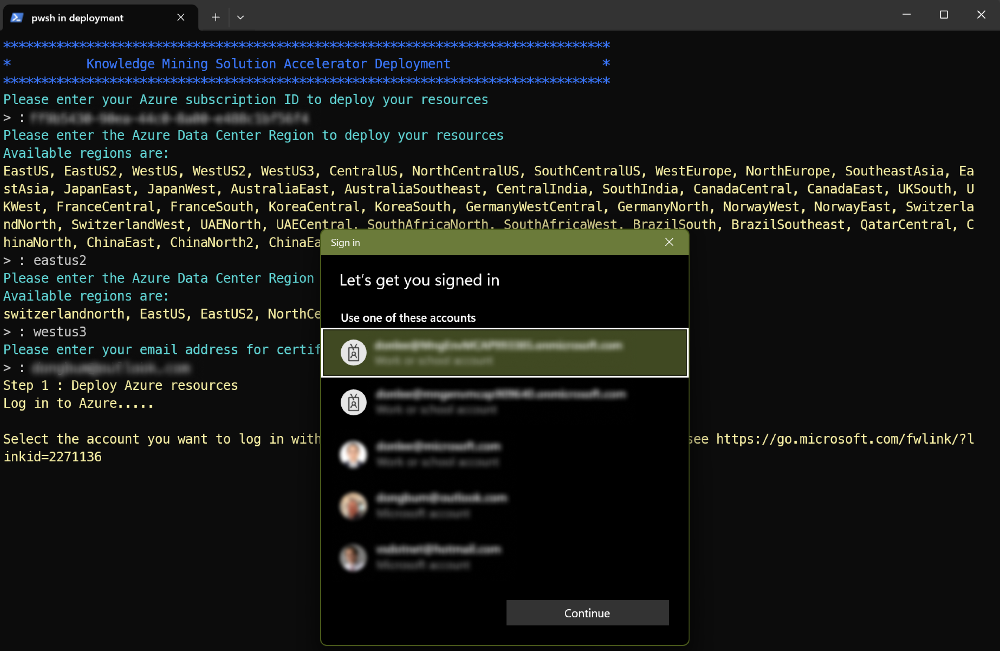
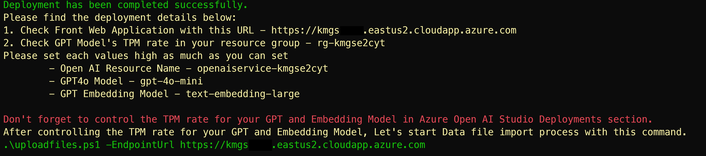
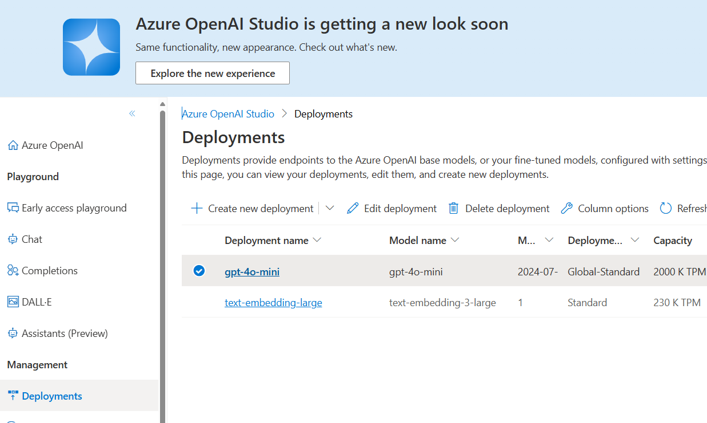
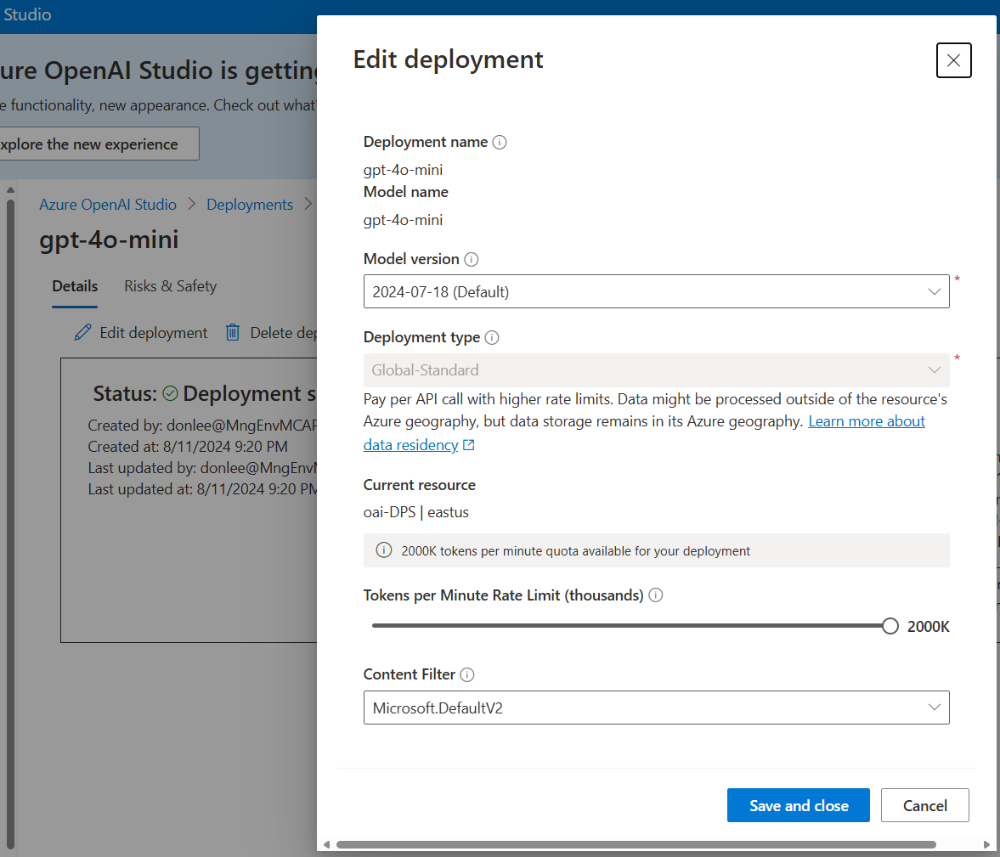

# Deployment Guide for Services

> This repository presents a solution and reference architecture for the Knowledge Mining solution accelerator. Please note that the  **provided code serves as a demonstration and is not an officially supported Microsoft offering**.
> 
> For additional security, please review how to [use Azure API Management with microservices deployed in Azure Kubernetes Service](https://learn.microsoft.com/en-us/azure/api-management/api-management-kubernetes).

## Contents
* [Prerequisites](#prerequisites)
* [Regional Availability](#regional-availability)
* [Deploy to Azure](#deploy-to-azure)
* [Post-Deploy Configuration](#post-deploy-configuration)
* [Next Steps](#next-steps)
    * [Test APIs](./docs/TestApis.md)
    * [Deploy Power Platform Client](./DeployPowerPlatformClient.md)

## Prerequisites

1. **[PowerShell](https://learn.microsoft.com/en-us/powershell/scripting/install/installing-powershell?view=powershell-7.4)** <small>(v5.1+)</small> - available for Windows, macOS, and Linux.

1. **[Azure CLI](https://learn.microsoft.com/en-us/cli/azure/install-azure-cli-windows?tabs=azure-cli)** <small>(v2.0+)</small> - command-line tool for managing Azure resources.

    2a. **kubectl** - command-line tool for interacting with Kubernetes clusters.  
        In PowerShell, run the following command:  

        az aks install-cli


    2b. **aks-preview**  - extension for Azure CLI to manage Azure Kubernetes Service.  
        In PowerShell, run the following command:  

        
        az extension add --name aks-preview
        
1. [Helm](https://helm.sh/docs/intro/install/) - package manager for Kubernetes

1. [Docker Desktop](https://docs.docker.com/get-docker/): service to containerize and publish into Azure Container Registry. Please make sure Docker desktop is running before executing Deployment script.

1. **Azure Access** - subscription-level `Owner` or `User Access Administrator` role required.


## Regional Availability

*Due to model availability within various data center regions, the following services have been hard-coded to specific regions.*

* **Azure Open AI (GPT 4o mini):**<br>
The solution relies on `GPT-4o mini` and `text-embedding-3-large` models which are all currently available in the 'WestUS3', 'EastUS', 'EastUS2', 'SwedenCentral' region.  
Please check the
[model summary table and region availability](https://learn.microsoft.com/en-us/azure/ai-services/openai/concepts/models#embeddings) if needed.

* **Azure AI Document Intelligence (East US):**<br>
The solution relies on a `2023-10-31-preview` or later that is currently available in `East US` region.  
The deployment region for this model is fixed in 'East US'


## Deployment

The automated deployment process is very straightforward and simplified via a single [deployment script](./deployment/resourcedeployment.ps1) that completes in approximately 10-15 minutes:

### Automated Deployment Steps:
1. Deploy Azure resources.
2. Get secret information from Azure resources.
3. Update application configuration files with secrets.
4. Set Application Configuration in Azure App Configuration.
4. Compile application, build image, and push to Azure Container Registry.
5. Configure Kubernetes cluster infrastructure.
6. Update Kubernetes configuration files.
7. Deploy certificates, ingress controller and then application images from Azure Container Registry.


### Execute Deployment Script:
Open PowerShell, change directory where you code cloned, then run the deploy script:  

```
cd .\Deployment\  
```  
```
.\resourdedeployment.ps1
```

If you run into issue with PowerShell script file not being digitally signed, you can execute below command:

```
powershell.exe -ExecutionPolicy Bypass -File ".\resourdedeployment.ps1"
```

You will be prompted for the following parameters with this Screen :  
  

1. **Subscription ID** - copy/paste from Azure portal
1. **Location** - Azure data center where resources will be deployed.

    *Please [check Azure resource availability and note hardcoded regions](#regional-availability). The following locations are currently supported: 
    
    ```
    'EastUS', 'EastUS2', 'WestUS', 'WestUS2', 'WestUS3', 'CentralUS', 'NorthCentralUS', 'SouthCentralUS','WestEurope', 'NorthEurope', 'SoutheastAsia', 'EastAsia', 'JapanEast', 'JapanWest', 'AustraliaEast', 'AustraliaSoutheast', 'CentralIndia', 'SouthIndia', 'CanadaCentral','CanadaEast', 'UKSouth', 'UKWest', 'FranceCentral', 'FranceSouth', 'KoreaCentral','KoreaSouth', 'GermanyWestCentral', 'GermanyNorth', 'NorwayWest', 'NorwayEast', 'SwitzerlandNorth', 'SwitzerlandWest', 'UAENorth', 'UAECentral', 'SouthAfricaNorth','SouthAfricaWest', 'BrazilSouth','BrazilSoutheast', 'QatarCentral', 'ChinaNorth', 'ChinaEast', 'ChinaNorth2', 'ChinaEast2'
    ```
1. **ModelLocation** - Azure data center where GPT model will be deployed.  
    The following locations are currently available :
    ```
    'WestUS3', 'EastUS', 'EastUS2', 'SwedenCentral'
    ```

1. **Email** - used for issuing certificates in Kubernetes clusters from the [Let's Encrypt](https://letsencrypt.org/) service. Email address should be valid.  

1. **GO !** - Deployment Script executes Azure deployment, Azure Infrastructure configuration, Application code compile and publish into Kubernetes Cluster.

<!-- 1. **Data File Upload and Processing**  - Once the deployment finished, The Sample Data File upload and Document processing starts. -->

### Manual Deployment Steps:
**Create Content Filter** - Please follow below steps
> * Navigate to Azure AI Studio
> * Click on Create Content Filter and set the filters to a high threshold for the following categories:
    ```
    Hate, Sexual, Self-harm, Violence
    ```
> * Please select the checkbox of profanity
> * Leave all other configurations at their default settings and click on create

### Deployment Complete
#### 🥳🎉 First, congrats on finishing Deployment!
Let's check the message and configure your model's TPM rate higher to get better performance.  
You can check the Application URL from the final console message.  
Don't miss this Url information. This is the application's endpoint URL and it should be used for your data importing process.  



## Next Steps

### 1. Configure Azure OpenAI Rate Limits

> **Capacity Note:**
> * The deployment script creates models with a setting of 1 token per minute (TPM) rate limit.
> * Faster performance can be achieved by increasing the TPM limit with Azure OpenAI Studio.
> * Capacity varies for [regional quota limits](https://learn.microsoft.com/en-us/azure/ai-services/openai/quotas-limits#regional-quota-limits) as well as for [provisioned throughput](https://learn.microsoft.com/en-us/azure/ai-services/openai/concepts/provisioned-throughput).
> * As a starting point, we recommend the following quota threshold be set up for this service run.  

| Model Name             | TPM Threshold |
|------------------------|---------------|
| GPT-4o-mini            | 100K TPM      |
| text-embedding-3-large | 200K TPM      |


1. Browse to Azure OpenAI Studio and select **each of the 2 models** within the `Deployments` menu:  


1. Increase the TPM value for **each model** for faster report generation:  


### 2. Data Uploading and Processing
After increasing the TPM limit for each model, let's upload and process the sample documents.
```
cd .\Deployment\
```

Execute uploadfiles.ps1 file with **-EndpointUrl** parameter as URL in console message.

```
.\uploadfiles.ps1 -EndpointUrl https://kmgs<your dns name>.<datacenter>.cloudapp.azure.com
```