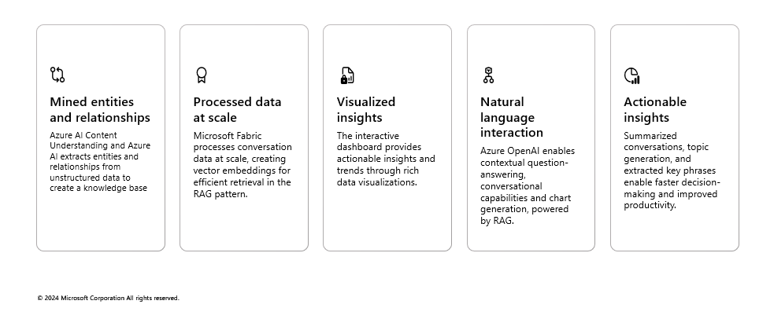
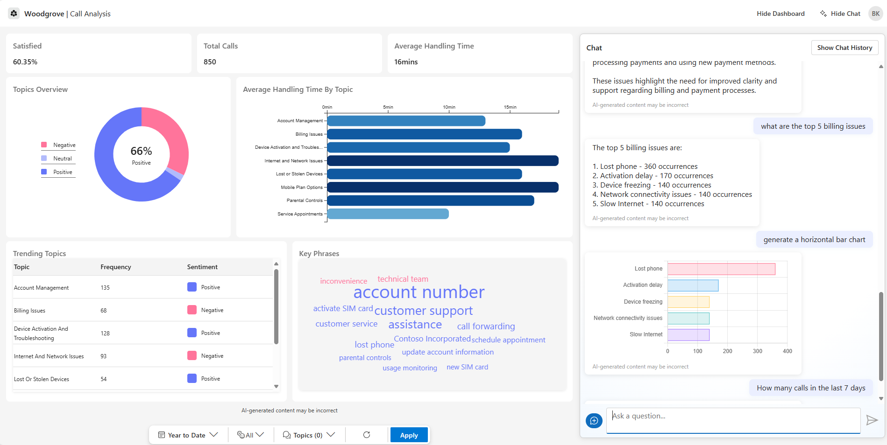
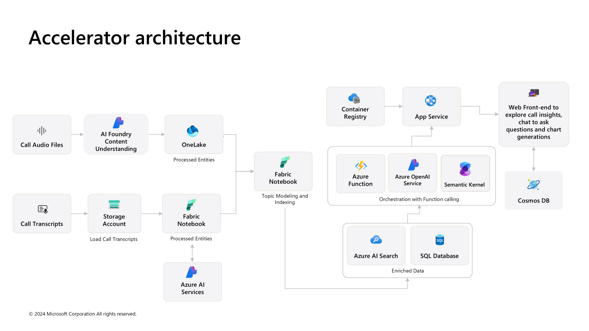
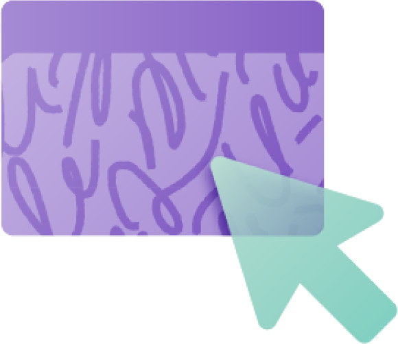

# Conversation knowledge mining solution accelerator

MENU: [**USER STORY**](#user-story) \| [**QUICK DEPLOY**](#quick-deploy)  \| [**SUPPORTING DOCUMENTATION**](#supporting-documentation) \|
[**CUSTOMER TRUTH**](#customer-truth)

<h2>
<br/>
User story
</h2>

### Overview

This solution accelerator enables customers with large amounts of conversational data to improve decision-making by leveraging intelligence to uncover insights, relationships, and patterns from customer interactions. It empowers users to gain valuable knowledge and drive targeted business impact. 

This solution accelerator leverages Azure AI Foundry, Azure OpenAI, Microsoft Fabric, and Azure Search to transform large volumes of conversational data into actionable insights through topic modeling, key phrase extraction, speech-to-text transcription, and interactive chat experiences.

**Version history:** An updated version of the Conversation Knowledge Mining solution accelerator was published on 01/16/2025. If you deployed the accelerator prior to that date, please see “Version history” in the [Supporting documentation](#supporting-documentation) section.

### Technical key features



Below is an image of the solution accelerator.



### Use case / scenario

An analyst managing large volumes of conversational data needs a solution to visualize key insights and uncover patterns using natural language. An interactive dashboard enables them to explore rich, actionable insights for faster, and more informed decision-making.
 
This solution empowers analysts with tools to ask questions and receive real-time, contextualized responses. It streamlines problem-solving, enhances collaboration, and fosters innovation by making data-driven insights accessible and shareable.

The sample data used in this repository is synthetic and generated using Azure Open AI service. The data is intended for use as sample data only.

### Solution accelerator architecture



<h2>
<br/>
Quick deploy
</h2>

### **Prerequisites**

To use this solution accelerator, you will need access to an [Azure subscription](https://azure.microsoft.com/free/) with permission to create resource groups and resources. 


### **How to install/deploy**

1. Please check the link [Azure Products by Region](https://azure.microsoft.com/en-us/explore/global-infrastructure/products-by-region/?products=all&regions=all) and choose a region where Azure AI Search, Azure OpenAI services, Azure AI Foundry Services are available. 

2. **Deploy Azure resources**  
   Click the following deployment button to create the required resources for this accelerator directly in your Azure Subscription.

   [](https://portal.azure.com/#create/Microsoft.Template/uri/https%3A%2F%2Fraw.githubusercontent.com%2Fmicrosoft%2FConversation-Knowledge-Mining-Solution-Accelerator%2Fkm-v3-staging%2FDeployment%2Fbicep%2Fmain.json)


   1.  Most fields will have a default name set already. You will need to update the following Azure OpenAI settings:

       -  Region - the region where the resources will be created in

       -  Solution Prefix - provide a 6 alphanumeric value that will be used to prefix resources
      
       -  Other Location - location of resources (required for Azure SQL and CosmoDB resources)
           
3.  **Create Fabric workspace**
    1.  Navigate to ([Fabric Workspace](https://app.fabric.microsoft.com/))
    2.  Click on Workspaces from left Navigation
    3.  Click on + New Workspace
        1.  Provide Name of Workspace 
        2.  Provide Description of Workspace (optional)
        3.  Click Apply
    4.  Open Workspace
    5.  Create Environment
        1.  Click ` + New Item ` (in Workspace)
        2.  Select Environment from list
        3.  Provide name for Environment and click Create
        4.  Select Public libraries in left panel
        5.  Click Add from .yml
        6.  Upload .yml from [here](./Deployment/scripts/fabric_scripts/ckm_cu_env.yml)
        7.  Click Publish
    6.  Retrieve Workspace ID from URL, refer to documentation additional assistance ([here](https://learn.microsoft.com/en-us/fabric/admin/portal-workspace#identify-your-workspace-id))

    ***Note: Wait until the Environment is finished publishing prior to proceeding witht the next steps.

4.  **Deploy Fabric resources and artifacts**
    1.   Navigate to ([Azure Portal](https://portal.azure.com/))
    2.   Click on Azure Cloud Shell in the top right of navigation Menu (add image)
    3.   Run the run the following commands:  
         1.   ```az login``` ***Follow instructions in Azure Cloud Shell for login instructions
         2.   ```rm -rf ./Conversation-Knowledge-Mining-Solution-Accelerator```
         3.   ```git clone https://github.com/microsoft/Conversation-Knowledge-Mining-Solution-Accelerator```
         4.   ```cd ./Conversation-Knowledge-Mining-Solution-Accelerator/Deployment/scripts/fabric_scripts```
         5.   ```sh ./run_fabric_items_scripts.sh keyvault_param workspaceid_param solutionprefix_param```
              1.   keyvault_param - the name of the keyvault that was created in Step 1
              2.   workspaceid_param - the workspaceid created in Step 2
              3.   solutionprefix_param - prefix used to append to lakehouse upon creation
5.  **Add App Authentication**
   
    Follow steps in [App Authentication](./Documents/AppAuthentication.md) to configure authenitcation in app service.


### Upload additional files

All files WAV files can be uploaded in the corresponding Lakehouse in the data/Files folder:

- Audio (WAV files):
  Upload Audio files in the *cu_audio_files_all* folder.


### Post-deployment
- To process additional files, manually execute the pipeline_notebook after uploading new files.
- The OpenAI prompt can be modified within the Fabric notebooks.


<br/>
<h2>
Supporting documentation
</h2>

### 

### How to customize 

If you'd like to customize the accelerator, here are some ways you might do that:
- Ingest your own [audio conversation files](./Documents/ConversationalDataFormat.md) by uploading them into the `cu_audio_files_all` lakehouse folder and run the data pipeline

### Additional resources

- [Microsoft Fabric documentation - Microsoft Fabric | Microsoft Learn](https://learn.microsoft.com/en-us/fabric/)
- [Azure OpenAI Service - Documentation, quickstarts, API reference - Azure AI services | Microsoft Learn](https://learn.microsoft.com/en-us/azure/ai-services/openai/concepts/use-your-data)
- [Azure AI Content Understanding documentation](https://learn.microsoft.com/en-us/azure/ai-services/content-understanding/)
- [Azure AI Foundry documentation](https://learn.microsoft.com/en-us/azure/ai-studio/)
- [Speech service documentation - Tutorials, API Reference - Azure AI services - Azure AI services | Microsoft Learn](https://learn.microsoft.com/en-us/azure/ai-services/speech-service/)


### Version history

#### Release 3
An updated version of the Conversation Knowledge Mining (CKM) solution accelerator was published on 01/16/2025. If you deployed the accelerator prior to that date, please note that CKM Release 3 cannot be deployed over CKM Release 2. Please also note that the CKM Release 3 conversation and audio file formats has been revised therefore files for prior releases are no longer compatible. For resources related to CKM Release 2, please visit our archive ([link-to-archive](https://github.com/microsoft/Conversation-Knowledge-Mining-Solution-Accelerator/tree/ckm-v2)).

#### Release 2
An updated version of the Conversation Knowledge Mining (CKM) solution accelerator was published on 08/15/2024. If you deployed the accelerator prior to that date, please note that CKM v2 cannot be deployed over CKM v1. Please also note that the CKM Release 2 JSON conversation file format has been revised to include additional metadata, therefore CKM v1 files are no longer compatible. For resources related to CKM v1, please visit our archive ([link-to-archive](https://github.com/microsoft/Conversation-Knowledge-Mining-Solution-Accelerator/tree/ckm-v1)).

<h2>
</br>
Customer truth
</h2>
Customer stories coming soon.

<h2>
</br>
Responsible AI Transparency FAQ 
</h2>

Please refer to [Transparency FAQ](./TRANSPARENCY_FAQ.md) for responsible AI transparency details of this solution accelerator.

<br/>
<br/>
<br/>

---

## Disclaimers

To the extent that the Software includes components or code used in or derived from Microsoft products or services, including without limitation Microsoft Azure Services (collectively, “Microsoft Products and Services”), you must also comply with the Product Terms applicable to such Microsoft Products and Services. You acknowledge and agree that the license governing the Software does not grant you a license or other right to use Microsoft Products and Services. Nothing in the license or this ReadMe file will serve to supersede, amend, terminate or modify any terms in the Product Terms for any Microsoft Products and Services. 

You must also comply with all domestic and international export laws and regulations that apply to the Software, which include restrictions on destinations, end users, and end use. For further information on export restrictions, visit https://aka.ms/exporting. 

You acknowledge that the Software and Microsoft Products and Services (1) are not designed, intended or made available as a medical device(s), and (2) are not designed or intended to be a substitute for professional medical advice, diagnosis, treatment, or judgment and should not be used to replace or as a substitute for professional medical advice, diagnosis, treatment, or judgment. Customer is solely responsible for displaying and/or obtaining appropriate consents, warnings, disclaimers, and acknowledgements to end users of Customer’s implementation of the Online Services. 

You acknowledge the Software is not subject to SOC 1 and SOC 2 compliance audits. No Microsoft technology, nor any of its component technologies, including the Software, is intended or made available as a substitute for the professional advice, opinion, or judgement of a certified financial services professional. Do not use the Software to replace, substitute, or provide professional financial advice or judgment.  

BY ACCESSING OR USING THE SOFTWARE, YOU ACKNOWLEDGE THAT THE SOFTWARE IS NOT DESIGNED OR INTENDED TO SUPPORT ANY USE IN WHICH A SERVICE INTERRUPTION, DEFECT, ERROR, OR OTHER FAILURE OF THE SOFTWARE COULD RESULT IN THE DEATH OR SERIOUS BODILY INJURY OF ANY PERSON OR IN PHYSICAL OR ENVIRONMENTAL DAMAGE (COLLECTIVELY, “HIGH-RISK USE”), AND THAT YOU WILL ENSURE THAT, IN THE EVENT OF ANY INTERRUPTION, DEFECT, ERROR, OR OTHER FAILURE OF THE SOFTWARE, THE SAFETY OF PEOPLE, PROPERTY, AND THE ENVIRONMENT ARE NOT REDUCED BELOW A LEVEL THAT IS REASONABLY, APPROPRIATE, AND LEGAL, WHETHER IN GENERAL OR IN A SPECIFIC INDUSTRY. BY ACCESSING THE SOFTWARE, YOU FURTHER ACKNOWLEDGE THAT YOUR HIGH-RISK USE OF THE SOFTWARE IS AT YOUR OWN RISK.  
