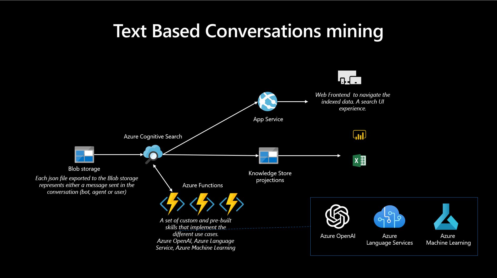
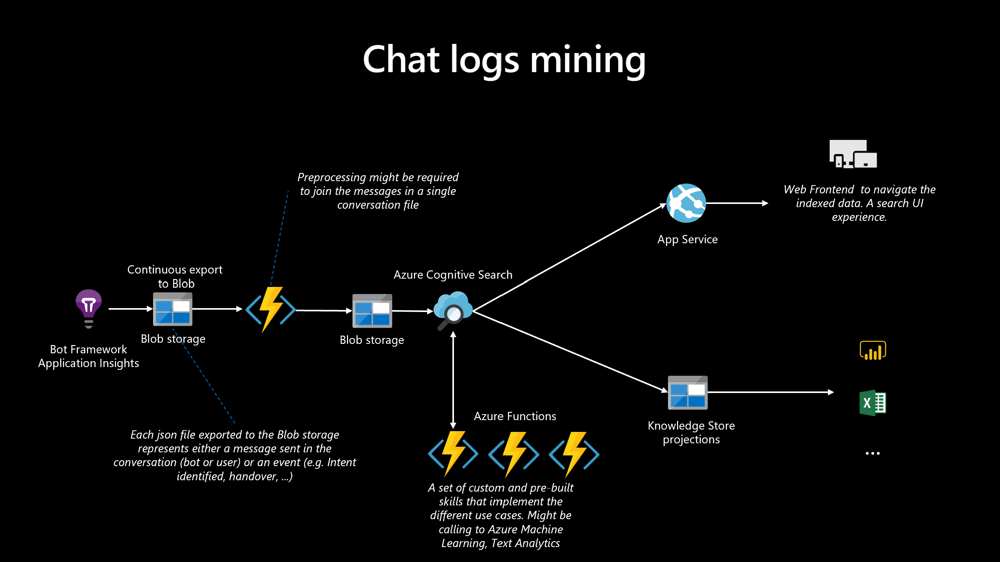

# Customer Service Conversational Insights with Azure OpenAI

## Knowledge Mining applied to Conversations

Every day a large amount of data is generated by Customer Services in the form of Natural Language conversations with customers. This data is stored as chat logs (with human agents or bots) or audio recordings from voice-based calls.

This is typically unstructured data that, if processed, can result in a great amount of insights for Contact Centers, add additional data to NBA models and provide a better view of the customer.

The Customer Service Conversational Insights is a solution accelerator built on top of Azure Cognitive Search, Bot Framework, Azure Speech Services and Azure OpenAI that allows customers to quickly deploy an integrated platform and immediately start extracting insights from customer conversations.

## [Navigate demo site [Click here]](https://conversational-knowledge-mining.azurewebsites.net/)
The demo site is built on hotel and travel booking conversations. Search for a city name to get started (e.g. seattle, milan, etc...)

# Getting started with Azure One Click deployment for multiple scenarios:
-   [Audio data](#audio-data)
-   [Text based conversation](#text-based-conversations)
-   [Bot framework data](#bot-telemetry-with-sample-data)

## IMPORTANT PRE-REQUISITES:
Please note that you need to have access to an Azure OpenAI resource and have already deployed a text-davinci-003 model in your resource if you want to enrich your data with Azure OpenAI.  

## Audio data
To deploy the full solution with audio files transcription and the Web Application, select the following button:
<br>
<br>
[](https://portal.azure.com/#create/Microsoft.Template/uri/https%3A%2F%2Fraw.githubusercontent.com%2Fmicrosoft%2FCustomer-Service-Conversational-Insights%2Fmaster%2Finfrastructure%2FARM%2Faudio-template.json)

The Azure portal displays a pane that allows you to easily provide parameter values. The parameters are pre-filled with the default values from the template.

Once the deployment is completed, start processing your audio files by adding them to the "audio-input" container in the "storage account" in your "Resource Group". 
To navigate the Web Ui, check the "App Service" resource in your "Resource Group".


The template builds on top of the [Ingestion Client for Speech service](https://docs.microsoft.com/en-us/azure/cognitive-services/speech-service/ingestion-client).
Please check here for detailed parameters explanations: [Getting started with the Ingestion Client](https://github.com/Azure-Samples/cognitive-services-speech-sdk/blob/master/samples/ingestion/ingestion-client/Setup/guide.md)

Learn more on how to configure your [Azure OpenAI prompt here](#integrate-your-openai-prompt)

### Architecture


## Text based Conversations
To deploy the full solution for Text based Conversations and the Web Application, select the following button:
<br>
<br>
[](https://portal.azure.com/#create/Microsoft.Template/uri/https%3A%2F%2Fraw.githubusercontent.com%2Fmicrosoft%2FCustomer-Service-Conversational-Insights%2Fmaster%2Finfrastructure%2FARM%2Fbot-template.json)


The Azure portal displays a pane that allows you to easily provide parameter values. The parameters are pre-filled with the default values from the template.

Once the deployment is completed, start processing your text conversation files by adding them to the "conversationkm-full" container in the "storage account" in your "Resource Group". Please refer to [Conversational data format](#conversational-data-format) for the JSON structure. Each conversation has to be stored in a different JSON file.
To navigate the Web Ui, check the "App Service" resource in your "Resource Group".


### Architecture



### Conversational data format
```json
{
    "ConversationId": "1f47eacf-c780-4ae2-ab2d-7b2e1386617f",
    "Messages": [
        {
            "Id": "2e1804ad-c856-4475-abc1-c831dc904935",
            "EventType": "MessageFromUser",
            "EventTime": "2016-08-17 20:42:03.592000",
            "ConversationId": "1f47eacf-c780-4ae2-ab2d-7b2e1386617f",
            "Value": "I need to book a flight to find my last Pokemon. I would need to leave from Montreal and go to Hiroshima. I will also need to leave on August 19th. Im with 4 other adults as well.",
            "UserId": "U2709166N",
            "CustomProperties": {
               "any_property" : "any_value"
            }
        },
        {
            "Id": "5b6284b5-a005-440e-9c4c-87c0c1b01333",
            "EventType": "MessageFromBotOrAgent",
            "EventTime": "2016-08-17 20:43:04.970000",
            "ConversationId": "1f47eacf-c780-4ae2-ab2d-7b2e1386617f",
            "Value": "Is there a budget for your trip?",
            "UserId": "U22HTHYNP",
            "CustomProperties": {
               "any_property" : "any_value"
            }
        },
        {
            "Id": "a13fb656-b6df-4d40-9458-93869af21e20",
            "EventType": "MessageFromUser",
            "EventTime": "2016-08-17 20:43:40.239000",
            "ConversationId": "1f47eacf-c780-4ae2-ab2d-7b2e1386617f",
            "Value": "Yes, $16600.",
            "UserId": "U2709166N",
            "CustomProperties": {
               "any_property" : "any_value"
            }
        },
        ...
    ]
}
```

## Integrate your OpenAI Prompt
You can add your Azure OpenAI prompt to extract specific entities in the template parameter OPENAI_PROMPT.
<br>
The defined keys have to be added in the OPENAI_PROMPT_KEYS parameter as well, to enable the data Push to the Azure Cognitive Search index.
<br>
Please be sure to set up both parameters accordingly to your entities name.

| Environment variable | Default value | Note |
|--|--|--|
|OPENAI_PROMPT | Execute these tasks:<br>-  Summarize the conversation, key: summary<br>-  Is the customer satisfied with the interaction with the agent, key: satisfied<br> Answer in JSON machine-readable format, using the keys from above.<br> Format the ouput as JSON object called 'results'. Pretty print the JSON and make sure that is properly closed at the end.<br>| The prompt to be used with OpenAI, please define the keys in the setting below as well |
|OPENAI_PROMPT_KEYS | summary:Edm.String:False,satisfied:Edm.String:True|The prompt keys to use for the OpenAI API. Format: key,SearchType,Facetable e.g. key1:Edm.String:False,key2:Edm.String:True,key3:Edm.String:True | 

### Modify the prompt after deployment

You can modify the Azure OpenAI prompt after the deployment by modifying the Azure Function application settings ("OPENAI_PROMPT", "OPENAI_PROMPT_KEYS") and creating the required field in the Azure Cognitive Search index.

## Bot Telemetry with sample data
To deploy the full solution with Bot sample data and the Web Application, select the following button:
<br>
<br>
[](https://portal.azure.com/#create/Microsoft.Template/uri/https%3A%2F%2Fraw.githubusercontent.com%2Fmicrosoft%2FCustomer-Service-Conversational-Insights%2Fmaster%2Finfrastructure%2FARM%2Ftemplate.json)

The Azure portal displays a pane that allows you to easily provide parameter values. The parameters are pre-filled with the default values from the template.

Once the deployment is completed, start processing your Bot telemetry by exporting in the "conversational-km-raw" container in the "storage account" in your "Resource Group". 
To navigate the Web Ui, check the "App Service" resource in your "Resource Group".

OPTIONAL:
You can also download a sample dataset [here](https://csciblob.blob.core.windows.net/deploy/sample-data-unprocessed.zip)
Unzip it and upload it in the "conversational-km-raw" container in the "storage account" in your "Resource Group".

### Architecture


